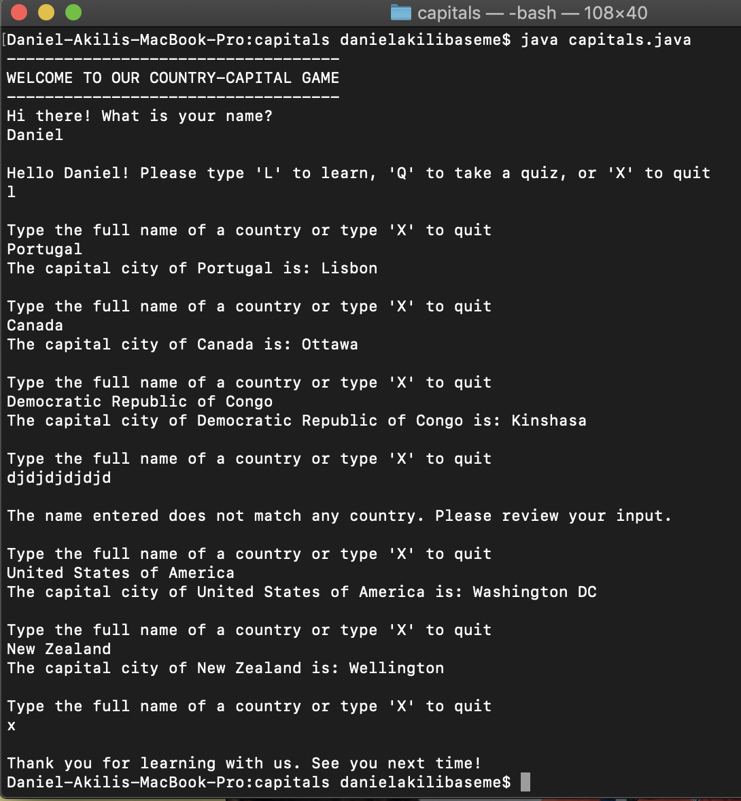
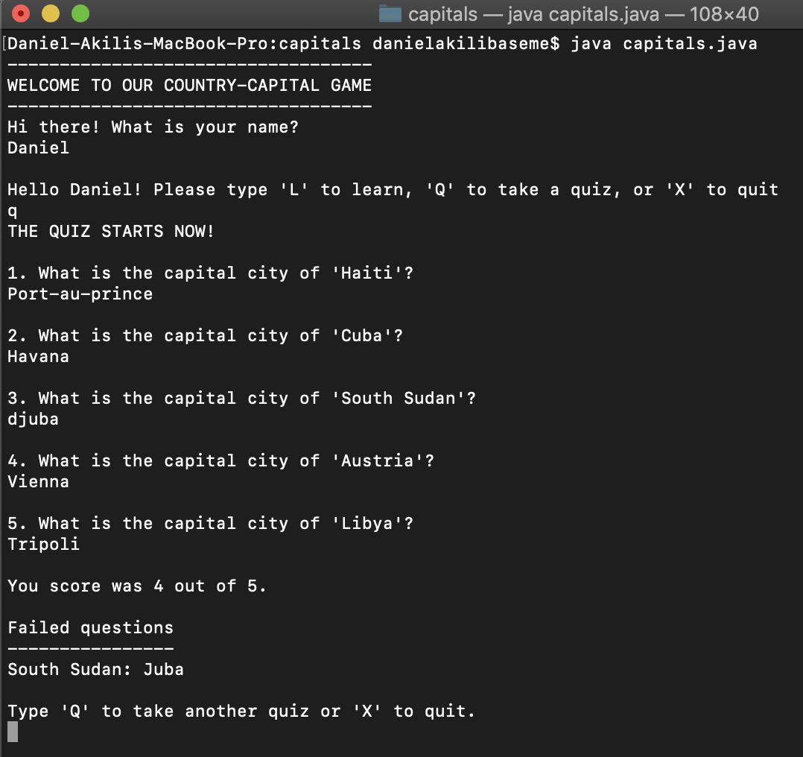
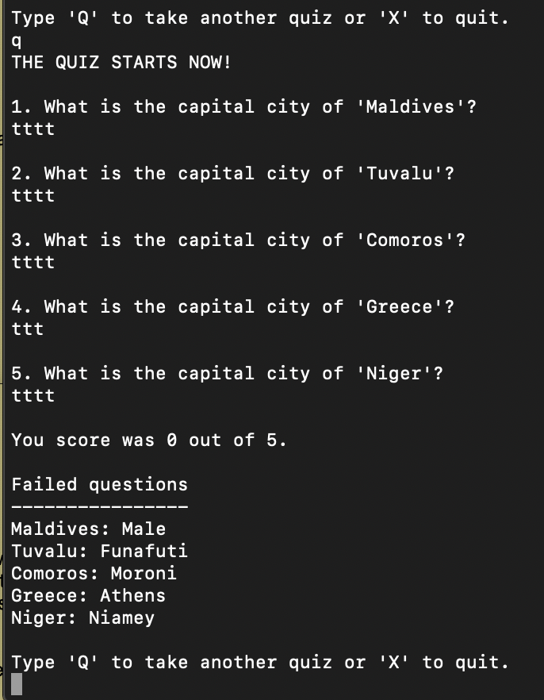

## CAPITALS.JAVA
Daniel Akili

#### Running

        `java capitals.java`

#### Usage:

* `capitals.java` helps the user to learn about countries of the world and their capitals cities in two different ways:

    1. **LEARNING**: The learning section allows the user to input a country name, and `capitals.java` will oputput its capital city. The user can learn as capital cities as they wish.

    2. **QUIZ**: The quiz section challenges the user with a short quiz of 5 questions. For each question, the user is asked to input the capital city. After all the 5 questions are done, `capitals.java` will print the score of the user as well as answers to failed questions, if any. The user can take as many quizzes as they wish

#### Commands:
*  `L` : to learn
*   `Q`: to take a quiz
*   `X`: to quit.

**Example output:**

1. LEARNING:

    ;

2. QUIZ:

    ;
    ;
    ;

