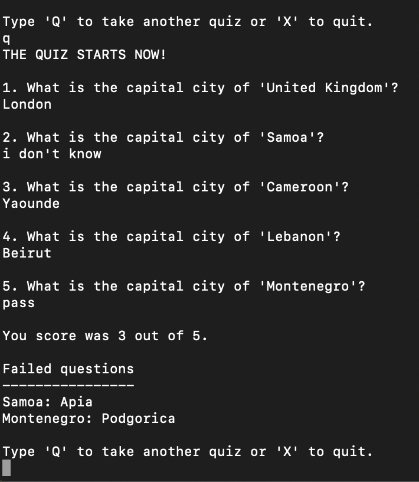

## CAPITALS.JAVA

Daniel Akili

#### Running

        `java capitals.java`

#### Usage:

- `capitals.java` is a small game that helps the user learn about countries of the world and their capitals cities as listed [here](https://www.boldtuesday.com/pages/alphabetical-list-of-all-countries-and-capitals-shown-on-list-of-countries-poster) in two different ways:

    1. **LEARNING**: The learning section allows the user to input a country name, and `capitals.java` will oputput its capital city. The user can learn as capital cities as they wish.

    2. **QUIZ**: The quiz section challenges the user with a short quiz of 5 questions. For each question, the user is asked to input the capital city. After all the 5 questions are done, `capitals.java` will print the score of the user as well as answers to failed questions, if any. The user can take as many quizzes as they wish

- The game ignores the case of letters entered by the user. Thus the entries `France`, `france`, and `FraNcE` are equivalent. So are `Paris`, `PARIS`, and `ParIS`.Same applies to commands.

#### Commands:

- `L` : to learn
- `Q`: to take a quiz
- `X`: to quit.

**Example output:**

1. LEARNING:

   ;

2. QUIZ:

   ;
   ;
   ;

#### Assumptions and limitations:

- South Africa and Sri Lanka have more than one capital cities listed.
  - For South Africa, the game only considers the administrative capital, Pretoria.
  - For Sri Lanka, the game only considers the economical/commercial capital, Colombo.
